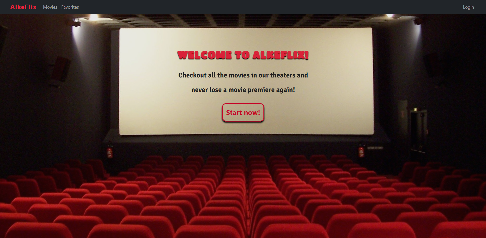
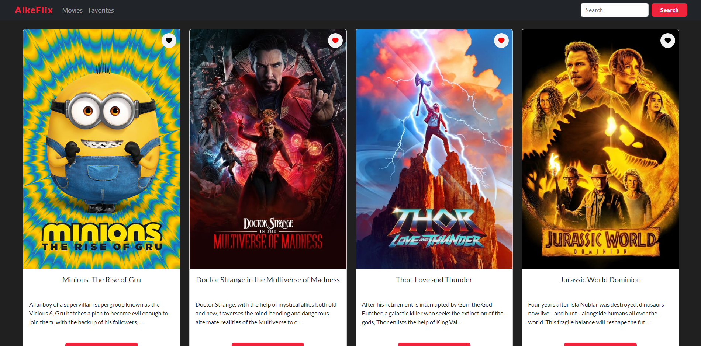
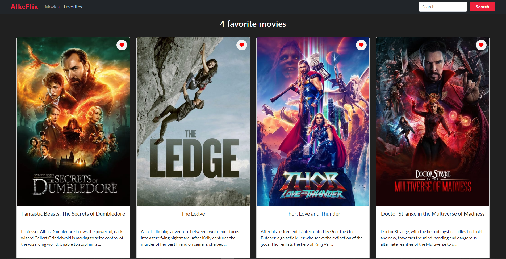
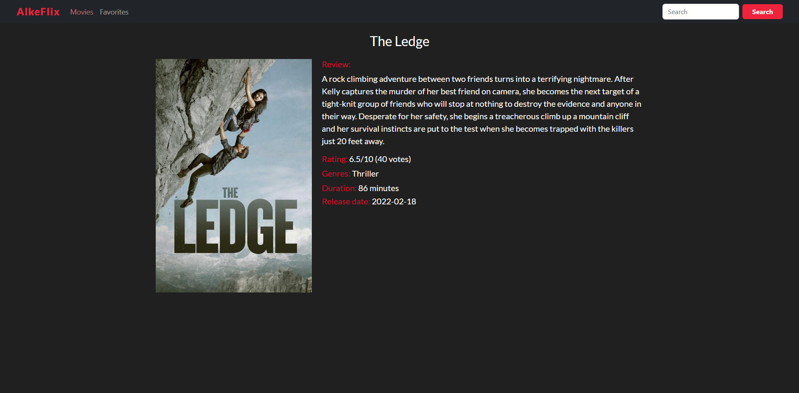
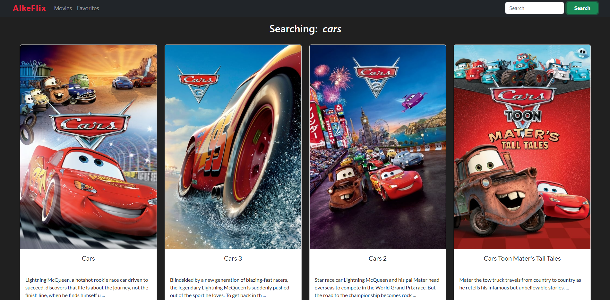

# Alkemy - React Skill Up Challenge

This is a solution to the Alkemy React Skill Up Challenge.

## Table of contents

- [Overview](#overview)
  - [The challenge](#the-challenge)
  - [Screenshot](#screenshot)
  - [Links](#links)
- [My process](#my-process)
  - [Built with](#built-with)
- [Author](#author)

## Overview

### The challenge

Users should be able to:

- Log in with alkemy credentials
- See a list of movies (sorted by popularity)
- Select favorite movies
- Remove movies from favorites
- Search movies by a keyword
- See movies details

### Screenshots

### Links

- Live Site URL: [Github project page](https://manugil22.github.io/Alkeflix/)

## My process

### Built with

- CSS custom properties
- Bootstrap 5.1
- Flexbox
- [React](https://reactjs.org/) - JS library

## Author

- Frontend Mentor - [@ManuGil22](https://www.frontendmentor.io/profile/ManuGil22)
